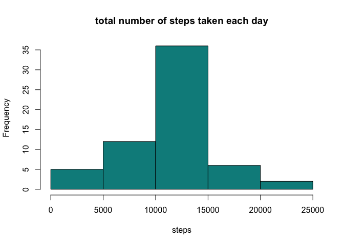

## Loading and preprocessing the data

```r
df = read.csv("activity.csv", header = T)
# check the data frame structure
str(df)
```

```
## 'data.frame':	17568 obs. of  3 variables:
##  $ steps   : int  NA NA NA NA NA NA NA NA NA NA ...
##  $ date    : Factor w/ 61 levels "2012-10-01","2012-10-02",..: 1 1 1 1 1 1 1 1 1 1 ...
##  $ interval: int  0 5 10 15 20 25 30 35 40 45 ...
```
## What is mean total number of steps taken per day?
For this part of the assignment, you can ignore the missing values in the dataset.

Calculate the total number of steps taken per day  

```r
steps_per_day = with(df,tapply(df$steps, as.factor(df$date), sum, na.rm=T))
```

Make a histogram of the total number of steps taken each day  

```r
hist(steps_per_day, 
     main = "total number of steps taken each day", 
     xlab = "steps",
     col = "cyan4")
```

<!-- -->

Calculate and report the mean and median of the total number of steps taken per day

```r
print(paste("The mean of the total number of steps taken per day is:",as.character(mean(steps_per_day))))
```

```
## [1] "The mean of the total number of steps taken per day is: 9354.22950819672"
```

```r
print(paste("The median of the total number of steps taken per day is:",as.character(median(steps_per_day))))
```

```
## [1] "The median of the total number of steps taken per day is: 10395"
```
## What is the average daily activity pattern?
Make a time series plot (i.e. type = "l") of the 5-minute interval (x-axis) and the average number of steps taken, averaged across all days (y-axis)

```r
average_steps = with(df, tapply(X = steps, INDEX = df$interval, FUN = mean,na.rm=T))
interval = levels(as.factor(df$interval))
plot(interval, average_steps, type = "l", 
     main = "Time series plot of the average number of steps taken", 
     xlab = "5-minute interval", ylab = "Average steps")
```

<!-- -->

Which 5-minute interval, on average across all the days in the dataset, contains the maximum number of steps?

```r
print(interval[which.max(average_steps)])
```

```
## [1] "835"
```
## Imputing missing values
Note that there are a number of days/intervals where there are missing values (coded as NA). The presence of missing days may introduce bias into some calculations or summaries of the data.

Calculate and report the total number of missing values in the dataset (i.e. the total number of rows with NAs)  

```r
missing = df[is.na(df$steps),]
print(nrow(missing))
```

```
## [1] 2304
```

Devise a strategy for filling in all of the missing values in the dataset. The strategy does not need to be sophisticated. For example, you could use the mean/median for that day, or the mean for that 5-minute interval, etc.  


```r
# Planning to fill in missing values with mean for that day 
complete_df = df[!is.na(df$steps),]
mean_steps = with(complete_df, tapply(steps, complete_df$interval, mean))
missing$steps = mean_steps
```

Create a new dataset that is equal to the original dataset but with the missing data filled in.
Make a histogram of the total number of steps taken each day

```r
new_df = rbind(complete_df,missing)
steps_per_day_new = with(new_df,tapply(new_df$steps, as.factor(new_df$date), sum))
hist(steps_per_day_new, 
     main = "total number of steps taken each day", 
     xlab = "steps",
     col = "cyan4")
```

<!-- -->

Calculate and report the mean and median total number of steps taken per day. 

```r
print(paste("The mean of the total number of steps taken per day is:",as.character(mean(steps_per_day_new))))
```

```
## [1] "The mean of the total number of steps taken per day is: 10766.1886792453"
```

```r
print(paste("The median of the total number of steps taken per day is:",as.character(median(steps_per_day_new))))
```

```
## [1] "The median of the total number of steps taken per day is: 10766.1886792453"
```

Do these values differ from the estimates from the first part of the assignment? What is the impact of imputing missing data on the estimates of the total daily number of steps?  

Answer: Yes, the mean and median differ from the first part of the assignment, imputing the missing data makes the data more symmetric. 

## Are there differences in activity patterns between weekdays and weekends?
Create a new factor variable in the dataset with two levels – “weekday” and “weekend” indicating whether a given date is a weekday or weekend day.

```r
weekday_class = function(date){
  day = weekdays(as.Date(date))
  if (day == "Saturday" | day == "Sunday"){
    return("weekend")
  } else {
    return("weekday")
  }
}
new_df$weekday = sapply(new_df$date,weekday_class)
new_df$weekday = as.factor(new_df$weekday)
```

Make a panel plot containing a time series plot (i.e. type = "l") of the 5-minute interval (x-axis) and the average number of steps taken, averaged across all weekday days or weekend days (y-axis). 

```r
library(ggplot2)
mean_steps_per_day = aggregate(steps ~ interval + weekday, new_df, mean)

ggplot(mean_steps_per_day, aes(interval, steps)) +
  geom_line() +
  facet_grid(weekday ~ .) +
  labs(x="Interval", y="Number of steps") +
  labs(title = "Time series plot for average number of steps taken weekday vs weekend")
```

<!-- -->

